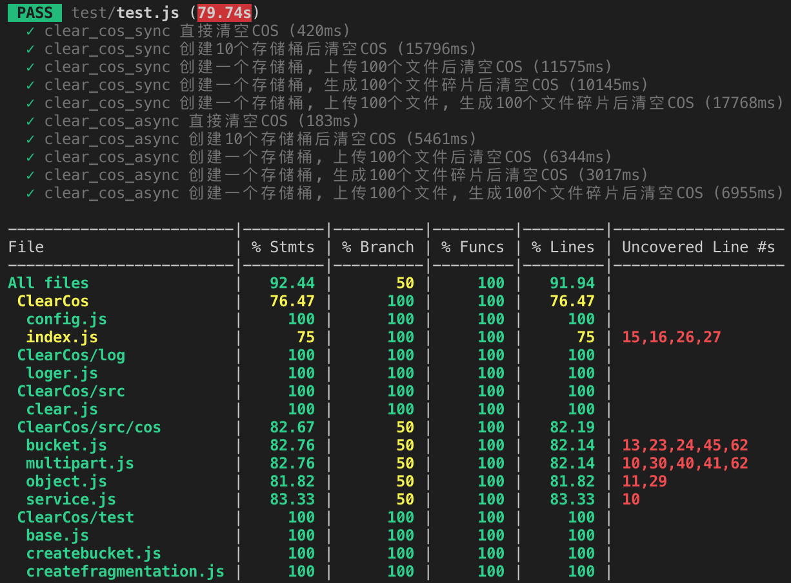

# 腾讯云 COS 清除脚本 

## 简介
这是一个用来清空腾讯云 COS 实例的 Node.js 脚本, 能一次性删除 COS 里全部的存储桶, 包括每个存储桶下存在的文件以及文件碎片  
为什么要写这样一个东西呢? 因为之前在测试环境创建了大量的存储桶, 上传了大量的文件, 产生了大量的存储费用, 到腾讯云官网控制台手动删除这些存储桶是一件很麻烦的事, 所以才会有了这个脚本  
⚠️警告: 不要轻易在生产环境使用, 删库跑路后果自负  

## 用法  
0. 下载或者 git clone 到本地
1. 在 config.js 中填入 COS 的 AppId, SecretId, SecretKey
2. npm install (如果很慢可以换成淘宝镜像 npm install --registry=https://registry.npm.taobao.org)
3. npm run start

## 目录结构
<pre>ClearCos
├── coverage                    [单元测试报告]      
├── log                         日志
│  ├── clear-cos.log            [日志文件]
│  └── loger.js 
├── node_modules                [node_modules/]
├── src                         
│  ├── clear.js                 !!!主要的删除逻辑都在这个文件里面
│  └── cos                      把原生 COS 回调函数改为 Promise 形式
│     ├── bucket.js  
│     ├── multipart.js  
│     ├── object.js  
│     └── service.js   
├── test                        单元测试
│  ├── base.js  
│  ├── createbucket.js  
│  ├── createfragmentation.js  
│  ├── createobject.js      
│  └── test.js                  npm run test 即可执行此文件
├── index.js                    入口
├── package-lock.json  
├── package.json                
├── README.md 
├── start.js                    npm run start 即可执行此文件
├── config.js                   COS 配置
└── webpack.config.js  
注: [] 表示需要运行之后才会产生的文件或目录
</pre>

## 正文
`src/cos` 下用于删除存储桶真正需要用到的 COS 函数只有 `getService()`, `getBucket()`, `multipartList()`, `multipartAbort()`, `deleteObject()`, `deleteBucket()`,  由于腾讯云 COS Node.js SDK 只提供了回调函数的形式, 使用起来极其不方便, 类似这种形式:
``` js
function clear() {
    cos.getService(params0, (err, data) => {
        cos.getBucket(params1, (err, data) => {
            cos.deleteObject(params2, (err, data) => {
                cos.deleteBucket(params3, (err, data) => {
                    ...
                })
            })
        })
    })
}
```
特别是 `deleteBucket()` 删除一个存储桶需要在 `deleteObject()` 删除所有文件并且 `multipartAbort()` 删除所有文件碎片之后才可能成功, 使用回调函数的形式难以满足要求, 因此很有必要将这些函数改成 Promise 的形式, 配合 `async` `await`使用很大程度上减少了流程控制的麻烦, 改完之后调用方式如下:
``` js
async function clear() {
    const {res0} = await cos.getService(params0);
    const {res1} = await cos.getBucket(params1);
    const {res2} = await Promise.all(cos.deleteObject(params2));
    const {res3} = await cos.multipartList(params3);
    const {res4} = await Promise.all(cos.multipartAbort(params4));
    const {res5} = await cos.deleteBucket(params5);
}
```
逻辑简单清晰, 一目了然   
在设置好 config.js 中的相关参数之后, `npm run start` 即可启动脚本  
`clear_cos_sync()` 会依次删除每一个文件、碎片以及存储桶, 速度慢但是稳定  
`clear_cos_async()` 是上述函数的并发版本, 速度快但是由于腾讯云的原因容易出错   
当然, 出错了也没什么关系, 再执行一次即可, 毕竟我们的目的只是删除所有对象. 最后吐槽一下腾讯云, 有一些 `bug` 到现在都没有修复, 也许是这些功能压根就没有人用过, 修不修都无所谓了, 说不定是 `feature` 呢

## 测试
`src/cos` 下的其他函数是为了方便测试用的, `npm run test` 即可启动测试  
需要指出的是短时间内大量创建删除存储桶很大概率会导致腾讯云返回 `存储桶已经存在` 或 `不存在存储桶` 的错误, 不出错的情况下会得到以下结果:  


## 日志
默认所有信息会输出到 `log/clear-cos.log` 文件中, 也可以在 `log/loger.js` 中修改相关配置

# 附录
[腾讯云 COS Node.js SDK](https://cloud.tencent.com/document/product/436/8629)
